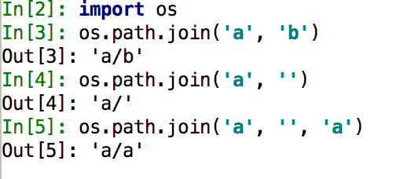

# python_skill
pythonの小技・テク

## 競プロ関連
[これ](./fast_input.py)

* 標準入力のイロハ

```open().readline```を関数オブジェクトとして用いることで高速で沢山の行数のinputが行える


## ソフト開発関連

### 削除関連

* shutil.rmtree()

* * ワイルドカード

  脳死でディレクトリのパス投げればいい

  投げたディレクトリ自体も消えるから

  ```python
  import shutil, os
  shutil.rmtree(path=ぱす)
  os.makedirs(ぱす)
  ```

  

  こんなかんじがスマート

  

  * 消したくない例外がある

  ```python
  import shutil, os, sys
  ぱす = './rm_target'
  れーがい = './rm_target/極秘エロ画像.png'
  ひなんじょ = '.'
  shutil.copy(れーがい, ひなんじょ)
  runaway = os.path.join(ひなんじょ, れーがい.split('/')[-1])
  try:
    shutil.rmtree(path=ぱす)
    os.makedirs(ぱす)
    shutil.copy(runaway, ぱす)
  except:
    sys.stderr.write('失敗した失敗した失敗した\n')
  finally:
    os.remove(runaway)
  ```

  例外の疎開先を提示して一時コピー

  ↓

  フォルダごとバニッシュからのmkdir

  ↓

  バニッシュにエラっても避難所にいる例外デコイは消えて終了  

    

  もっと安全でスマートな書き方があるかも


### パス関連

* os.path.join()

空stringを突っ込むと無視される　これが意外と役に立つ




## 機械学習関連

### tensorflow

* エラーハンドリング

  * tf.get_default_graph()

  メイングラフを返す

  グラフが複数存在する際に役に立つ

  クラス変数でコレを保持しておけば```コレ.as_default()```でデフォルトにできる

  ちなwith構文で書くと楽

  モデルを呼び出してpredictするAPI持ったアプリとか作るときとかエラー対策になる

  

  **例　./modelに置いてあるモデルを使って画像をPOSTしてinferenceするflask製アプリケーション**

  ```python
  import os
  import sys
  import random
  import string
  import inspect
  import numpy as np
  from flask import Flask, request, send_from_directory, render_template, redirect, url_for
  from keras.models import load_model
  from keras.preprocessing.image import load_img, img_to_array
  from werkzeug.utils import secure_filename
  
  # measure of multi threads bug in keras.
  import tensorflow as tf
  
  
  class PredApp:
      def __init__(self, *args):
          self.app = Flask(__name__, static_url_path='')
          self.classes = args if len(args) != 1 else args[0]
          self.img_size = 100
          print(self.classes)
          self.upload_folder = './uploads'
          os.makedirs(self.upload_folder, exist_ok=True)
          self.app.config['UPLOAD_FOLDER'] = self.upload_folder
          self.app.config['MODEL_DIR'] = './model/'
          self.allow_ext = set(['jpeg', 'jpg', 'png', 'gif'])
          self.port = 3553
          self.host = 'localhost'
          self.graph = tf.get_default_graph()
          self.log_path = self.__make_log()
  
      def run(self, made_model_name):
          @self.app.route('/')
          def admin_test():
              return render_template('admin.html')
  
          @self.app.route('/pred', methods=['GET', 'POST'])
          def pred():
              with self.graph.as_default():
                  if request.method == 'POST':
                      img_file = request.files['img_file']
                      if img_file and self.__allowed_file(img_file.filename):
                          fname = secure_filename(img_file.filename)
                          img_file.save(os.path.join(self.app.config['UPLOAD_FOLDER'], fname))
                          img_path = os.path.join(os.getcwd(), 'uploads', fname)
                          try:
                              model = self.__load_model(os.path.join(self.app.config['MODEL_DIR'], made_model_name))
                              print(img_path)
                              propreccing_img = img_to_array(load_img(img_path, grayscale=True, target_size=(self.img_size, self.img_size)))
                              infer_target = np.array([propreccing_img]).astype('float32') / 255
                              result_status = model.predict(infer_target, verbose=0, batch_size=1)
                              result_class = self.classes[result_status[0].argmax()]
                              result = [result_class, result_status[0]]
  
                          except Exception as e:
                              return render_template('index.html', img_path=img_path, result=str(e))
  
                          self.__write_log(log_path=self.log_path,
                                           model=made_model_name,
                                           image=img_path,
                                           result=result_class,
                                           result_value=str(result_status[0][result_status[0].argmax()])
                                           )
                          return render_template('index.html', img_path=img_path, result=result)
                      else:
                          return '''
                          <p>許可されていない拡張子です</p>
                          '''
                  else:
                      return render_template('index.html')
  
          @self.app.route('/uploads/<fname>')
          def uploaded_file(fname):
              return send_from_directory(self.app.config['UPLOAD_FOLDER'], fname)
  
          self.__startup_browser(port=self.port, host=self.host)
  
      def __startup_browser(self, port=3553, host='localhost'):
          try:
              self.app.run(host=host, port=port)
          except Exception as e:
              sys.stderr.write(str(e))
              sys.exit(0)
  
      def __random_str(self, n):
          return ''.join([random.choice(string.ascii_letters + string.digits) for i in range(n)])
  
      def __allowed_file(self, fname):
          return '.' in fname and fname.split('.', 1)[1] in self.allow_ext
  
      def __load_model(self, made_model_name):
          return load_model(made_model_name)
  
      def __make_log(self):
          exists_log = False
          rel_hierarchy = 2
          toplevel_path = '/'.join(inspect.stack()[0][1].split('/')[:-rel_hierarchy])
          log_dir_path = os.path.join(toplevel_path, 'data')
          print(os.listdir(log_dir_path))
          if not 'log.umeume' in os.listdir(log_dir_path):
              print('log file init.')
              with open(os.path.join(log_dir_path, 'log.umeume'), 'a') as log:
                  log.write('')
                  exists_log = True
          else:
              exists_log = True
          if exists_log:
              return os.path.join(log_dir_path, 'log.umeume')
          else:
              return None
  
      def __write_log(self, log_path, **info):
          with open(log_path, 'a+') as log:
              for key, value in info.items():
                  f = "{}:{}\n".format(key, value)
                  log.write(f)
              log.write("----------\n")
  ```

  

